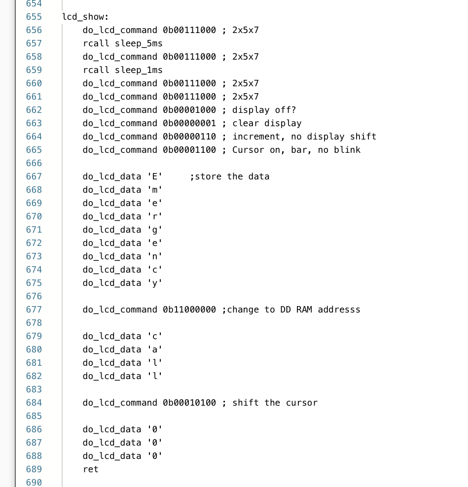
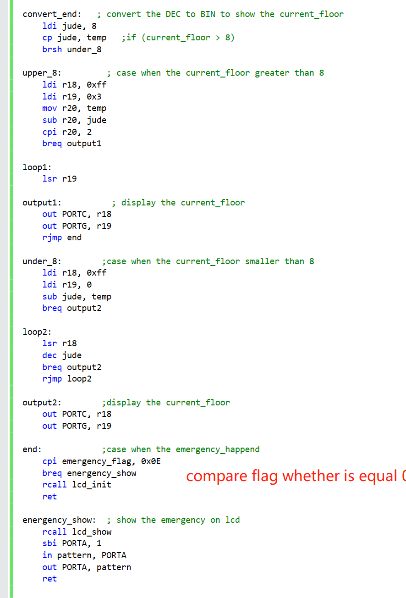

# Emulator Developer Guide

<!--- Group info -->
<p align="center">
UNSW DESN200 23T2 (COMP)
</p>
<p align="center">
Group: "Group C"
</p>
<p align="center">
Members: Thenuja Wijesuriya(z5343238), Zhongtai Zhang(z5330019), Yicong Chen(z5292435), Yuanxu Sun(z5292226)
</p>
<!--- Group info -->


---

<!--- Remove the following -->
The developer guide is an essential document that describes the design of your code for future developers who may need to extend, optimize, or fix bugs in the codebase. This guide assumes that you are no longer available to offer assistance to future engineers, so it should be comprehensive and easy to understand.

Please modify this template `dev-guide.md` file to create your own developer guide. Make sure to follow the instructions provided and refer to the [Markdown Guide Cheat Sheet](https://www.markdownguide.org/cheat-sheet/) for Markdown syntax.


## Table of Contents

1. [Introduction](#introduction)
2. [Code Structure](#code-structure)
3. [Component Mapping](#component-mapping)
4. [Key Functions](#key-functions)
5. [Extending the Code](#extending-the-code)
6. [Optimizing Performance](#optimizing-performance)
7. [Bug Fixes](#bug-fixes)
8. [Additional Resources](#additional-resources)

## Introduction

<!--- Remove the following -->
1. The main purpose of this code library is to make an elevator microcontroller through the avr2560.
    
2. This microcontroller is composed of LCD, LED, keypad, motor, and so on. By pressing the desired floor on the keypad, the elevator will automatically run to the floor the user wants. During the operation, the number of LED lights will change accordingly with the operation of the elevator, and the LCD screen will display the elevator The current floor is running, and the motor rotates with the running of the elevator door.

## Code Structure

<!--- Remove the following -->
1. The program contains three parts 1. main function and its branch 2. Functions 3. Interrupts

2. The main function is basically used to change the state of the lift, it can move the lift up or down, and close or open the door.

3. The functions are created to serve the main function. Such as display_level, motor_start, motor_stop , emergency_stop and etc.

4. The interrupt contain timer, INT0, INT1, they are used in different case
   
## Component Mapping

In this section, there is a summarized outline about how the main parts of our source code are related to the design components of the elevator simulator. The main sections of our simulator includes how the code relates to the functions when the lift is moving, stopped and during an emergency.

### Timer 
The timer starting in this section of the code has been used to implement all the delays in our simulator. For example we have used the timer to make the lift wait 3 seconds after stopping, close or open the door for 1 second, 7812 has been used where one second of the timer is required.
During the program a loop is used to check if the time is reached. The section where the initial part of this timer starts is hown below and has been called later in our source code where necessary.


The image below shows the loop to check whether the required time has passed in the timer.


### Movement 

These two images below show some highligts of the code that helps the lift simulator to move up and down.


The functions labelled rowloop, nextcol, skipconv and next coll are all used in the process of checking if numbers on the keypad were pressed while the main function in our program will keep scanning the keypad. If a key press is detected using these functions then it is passed onto the convert_end function to convert from Decimal to Binary display format on LCD.


The function labelled convert_end will be used to convert the values to the format which can be displayed onto the LCD. There are two cases, upper_8 function is used when the floor is greater than 8 and under_8 is used when the current floor is smaller than 8. After each of these cases the floor number to be displayed will be displayed on the screen using the convert_end, lcd_init and current_show parts of our source code.


The two code sections below will initialize and show 'next floor' and the 'current floor' before the correct floor numbers are displayed next to each of these labels respectively.


All the images above in the movement section assists in performing the required functions when the lift simulator is moving.

### Stopped & Close Door 

When the lift stops the LED lights will remain at one level showing the current floor the lift is on and the lift door will immediately start to open. While opening the close door button (Push button P1 n board) can be presse do close door as soon as the door opens, otherwise the automatic feature is that the lift door will open, remain pen for 3 second and then close the door before it's ready to accept another floor request for moving. 

The opening and closing door features are indicated by the rotating motor. The functions used to rotate the motor is shown in the image below.


The motor will be stopped by setting PWM speed to 0 as shown in the code below.


The execute function shown below is called during the process to activate the time.


The code sections labelled 'stop' and 'stop_loop' are used rotate the motor for one second o indicate the automatic opening of the door for once second once the lift is stopped.
Sections labelled 'stay_current_setting' and 'stay_current' are used to stop the rotation of the motor for 3 seconds to indicate the lift door is remaining for 3 seconds after the door has fully opened. Finally, the sections labelled 'close_door_setting' and 'close_door' are used to rotate the motor again for one second to indicate the automatic closing door feature of the lift doors for one second before the lift is ready to accept floor requests again. In summary the code below will be used to indicate the motor rotating for a second(open door), remain without moving for 3 seconds(door is kept open) and rotate again for 1 second (close door).


This EXT_INT code below is used to initialize and enable the interrupt so that the simulator will recognize when the push button p1 is pressed to close the lift door. This interrupt will only work when the lift is stationary and stopped on one floor. The interrupt is first called to initialize in the main function and sections of the code inside the previous images of open and close door features check if this push button has been pressed in the open door and stay current stage to ensure the lift door closes immediately if the external interrupt p1 is set to 1.


### Emergency 

The emergency section of the code will cause the lift simulator to move all the down to ground floor, blink the strobe LED light while opening the lift doors automatically and then displaying 'Emergency Call 000' on the LCD Display. This process is done by the code shown below with the help of the movement and the Stopped & Open/Close door processes.
 
All the previously explained functions are used in the emergency process but the main sections which are special to the emergency design component of the lift is shown in the images below.




### Main & Go_Back 

The 'main' labelled section of the code below is where the external interrupt EXT_INT1_INIT is called to initialize the interrupt to work and the main function also initializes the output PORTS which are neccessary for the other processess in the lift later andalso plays an important part in reading the keypad presses from the board, if the emergency button is pressed the code will immediately jump to the emergency sections of the code and initiate the emergncy process. The 2 second timer for the lift to travel in between floors is shown in the 'main_next' part of the code.

The halt part of the code will continuously compare the current floor with the required floor to check if the lift needs to be stopped on a cerain floor or not. 


The 'go_back' section of the code will reset and clear all the parameters before jumping back to thhe 'main' section of our cource code.


The above descriptions for the code is only a summary of the main parts that are linked with the design components, however all the code above is linked to gether in our souce code and connected in a way that each code is used to perform many functions that are also related to the other main processes of the elevator simulator.

## Key Functions
<!--- Remove the following -->
In the project, our design philosophy is more about making users safer and more convenient. Therefore, the LCD and motor display parts are particularly important. Because they can reflect the current running state of the elevator to the greatest extent.
<!--- Remove the following -->
| Function | How To Work | Importance |
|---|---|---|
| convert | receive the signal from the keyboard, and put the value of the pressed button into a variable called require_floor. Also, check the value of the pressed key is the number shown on the keypad. If the value of the pressed key is not a number (except * it for emergency) the function will not put the value into require_floor | The user can input through the Keypad, and the result is processed by this function. Make the simulated elevator go to the correct floor |
| convert_end | Convert the DEC to BIN to show the current_floor | If the LCD is used to display the current result, it can clearly prompt the user to have reached the current floor. |
| motor_move | Set OC3B (PE4) as output for motor control, and initialize Timer 3 for phase correct PWM mode with prescaler 1 | Simulate the opening of the elevator door, which can prompt the user the current state of the elevator door. |
| motor_stop | Set OC3B (PE4) to 0. | Simulate the closing of the elevator door, which can remind the user of the current status of the elevator door. |
| lcd_show | When "*" is used, use the LCD to output "Emergency call 000" | Prompt the user that the elevator is currently in an emergency state, and do not use the elevator for safety reasons. |

## Extending the Code

<!--- Remove the following -->
### Guidelines for extending the code:
The most important things to do when expanding the code are the following three points:
1. Complete this section of code in a new file.
2. Make this code into a function, and check the correctness of this code.
3. After completion, consider the fit of the overall code and add it to the project document.
### A simple example of trying to extend the code:
Here is a very simple example of extending the code in the project - when the emergency button is used, the LCD displays line 1: "Emergency" and line 2: "Call 000".
1. Complete this section of code in a new file. (docs/extend code/extend1.asm)
<!--- Remove the following -->
   Result: It is work.
   
2. Make this code into a function, and check the correctness of this code. (docs/extend code/extend2.asm)
<!--- Remove the following -->
   Result: It is work.
   
3. After completion, consider the fit of the overall code and add it to the project document. (docs/extend code/extend3.asm)
<!--- Remove the following -->
   Result: It is work.
   
## Optimizing Performance
<!--- Remove the following -->
### Efficient algorithms
When we want to optimize the algorithm, it is to increase the speed of the system processing code and increase the efficiency of resource utilization. So, there are some suggestions to improve the performance of the algorithm:
1. Increase the operation of calling I/O registers: some commonly used values that do not need to be modified can be transferred to I/O registers, which makes the registers that can be used freely more flexible.
2. The method of optimizing calculation: For example, loop calculations can be replaced by bit operations. This can improve code execution speed and increase readability.
<!--- Remove the following -->
### Data structures
When we want to optimize the code structure, the main goal is to make the code clearer and more readable, so we can do the following:
<!--- Remove the following -->
1. Write the code in a modular form: the code can be made into independent modules, and each module completes a specific function. This ensures that the functions are single and concise to increase readability.
2. Avoid overly large functions: We can split a large function into multiple small functions, each of which only completes a specific task. This reduces the complexity of each function and improves the readability and maintainability of the code.
3. Make naming more accurate and standardized: Make function names and variable names more meaningful, which can increase the readability of the code and allow other designers to better understand the code.
4. Add comments: Add detailed comments to the code to explain the purpose and implementation of the code, which can increase the readability of the code and allow other designers to better understand the code.
## Bug Fixes

<!--- Remove the following -->
Bug1: The keypad numbers and the LED show
Because the value we return in the keypad function is a decimal value, so we need to convert it to a binary value to display it on the LEDS normally.

Solution:
Using a function can change the decimal number to a binary number.


Bug2: When the elevator is running below the 8th floor, the top two LEDs will always turn on

Solution:
Need to add a branch to judge whether the value returned by the keypad is greater than 8 or less than 8, if it is less than 8, only PORTC will be output, if it is greater than 8, PORTC and PORTG will be output at the same time

Bug3:
we can't stop the timer.

Solution:
We add two functions, one function is to set TIMSK0 to 0, which can suspend the interrupt timer0, and the other is set to 1, to start the interrupt.


Bug4:
The time of the timer has not changed. For example, the movement interval between each floor is 2 seconds, and the process of opening and closing the door can only last for 2 seconds.

Solution:
We have added some logical judgments, for example, when current_floor is equal to require_floor, we pause the timer, and reset the new time to the timer before starting the timer.

.png)
.png)

Bug5:
The LCD always fails to display the number of the current floor

Solution:
Add a function to convert decimal to the corresponding ASCII form.

.png)
.png)

Bug6:
motor never running

Solution:
It is necessary to check whether the wire connected to the motor on the board is correctly connected to PE2, and then the port to be output in the code is PE4.

.png)
.jpg)

Bug7:
Interrupted Conflict Issues

Solution:
Every time an interrupt is executed when we want to enable other interrupts, we must turn off the interrupt being executed before the next interrupt can be executed, so we added 6 equations, which are to turn on and off the interrupt equation.

Bug8:
When the asterisk (emergency service) is pressed, the LCD will still display the current floor, and will not change to emergency service.

Solution:
We set an emergency flag, when the asterisk is pressed, a value will be stored in the emergency flag, when the value in the emergency flag is no longer 0, the program will enter the emergency branch, and the LCD will display emergency services.



## Additional Resources

<!--- Remove the following -->
[Include any additional resources that may help future developers understand and work with the codebase, such as links to relevant documentation, libraries, or tools.]

> **Note**: You can store images in the `docs/images/` directory. To include an image, use the following Markdown syntax:

```markdown

```


