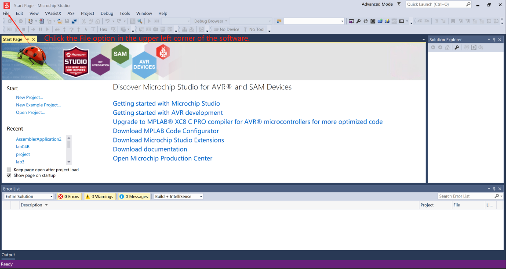
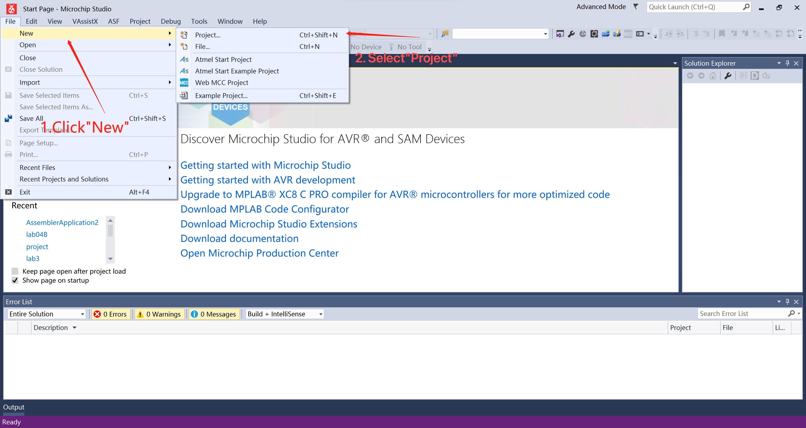
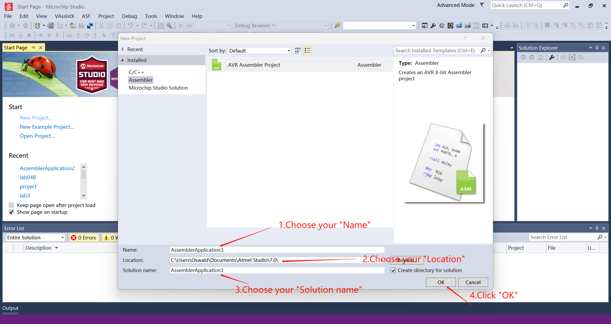
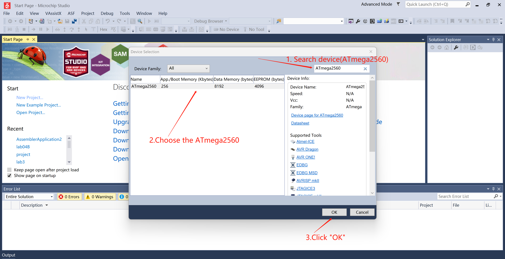
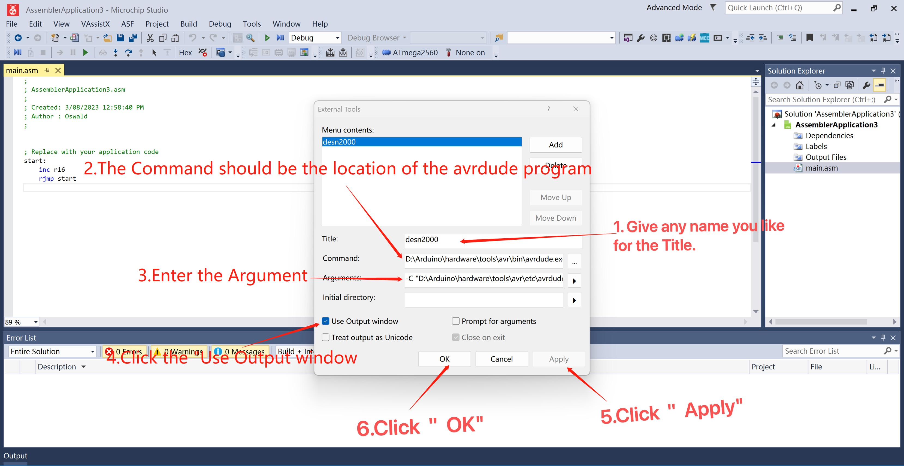
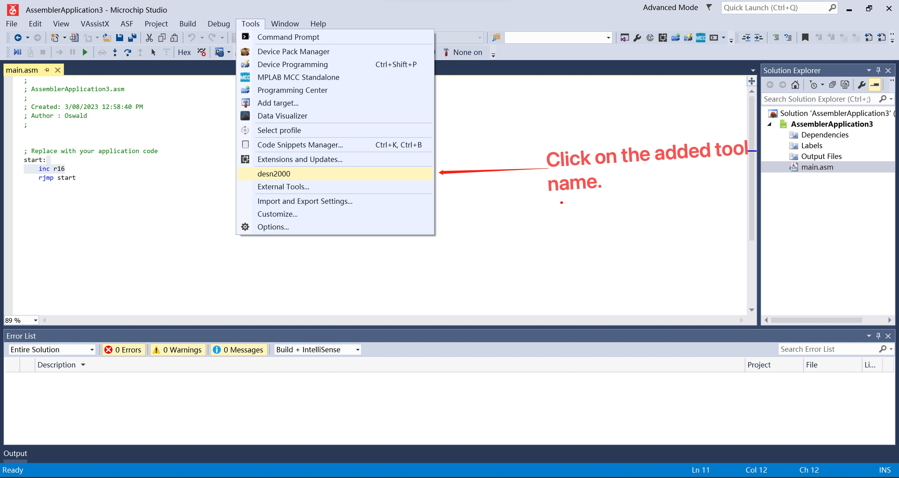
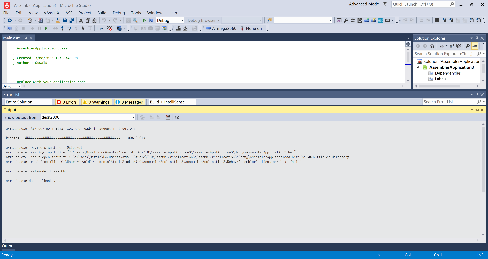
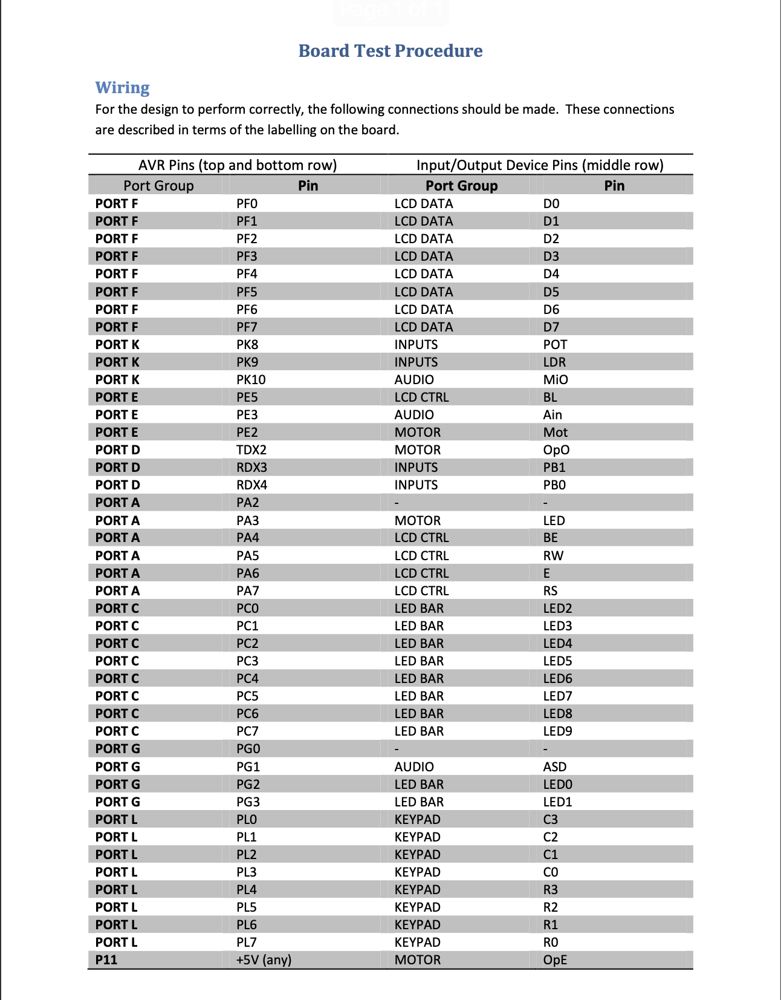

# Emulator User Guide

## Table of Contents

1. [Introduction](#introduction)
2. [Installation](#installation)
3. [Configuration](#configuration)
4. [Selecting Input/Output Components](#selecting-inputoutput-components)
5. [Testing Functionality](#testing-functionality)
6. [Troubleshooting](#troubleshooting)
7. [Additional Resources](#additional-resources)

## Introduction

In this project, our team will use the AVR2560 microcontroller to simulate the functionality of a real elevator. The elevator can accept the user's request and execute the user's instruction according to the current state of the elevator.

In this simulated elevator you can use the following functions:
1. Multi-Floor realization: users can use the keypad to input the floor they want to go to, after which the elevator will arrive at the floor.
2. Opening and Closing the door: the user can use the door opening and closing button to input whether to open or close the door and then the elevator will realize it according to the current situation.
3. Elevator stop: When the elevator reaches the floor specified by the user, the elevator will automatically open the door, stop and close the door.
4. Elevator emergency key: When an emergency occurs in the elevator, the user can use the keypad to input an emergency command, after which the elevator will stop running and send the user to the ground floor.

## Installation

### System Requirements 

The product will have an Atmega2560 board, the cable to connect the board, and the necessary wire connections needed to run the elevator simulator on your computer.

1. A computer running on a Windows Operating System or if the computer is not Windows then use a virtual machine to run Windows on your computer.
2. The computer should have a fully functioning USB Type-A port to connect the Atmega2560 board.

### Steps for Installation Setup

1. Download the Arduino IDE using the given link: https://www.arduino.cc/en/software
2. Download the Microchip AVR controller using the given link: https://www.microchip.com/en-us/tools-resources/archives/avr-sam-mcus
3. Using the USB cable given with our product, connect the USB Type-B side of the cable to the Atmega2560 board and the USB Type-A side to the port on your computer.
4. Once connected check for a visible green or blue light to ensure that the board has been successfully connected to the computer.  
5. Please check the configuration section for instructions on how to set up the AVR microcontroller and run the elevator simulator on the Atmega2560 board.
   
## Configuration   

You need to configure the software if you want to use the simulated elevator on the computer.

### Steps to configure the file:
1. Click the File option in the upper left corner of the software.
   
2. Create a new project.
   
3. Name the project.
   
4. Select the device(ATmega2560)
   
5. Copy the code of our project and save it.

## Selecting Input/Output Components

In order to run the elevator simulator you need to connect the external board (Atmega2560) to the microchip studio controller software. Please follow the instructions below to connect the board to the software.

### Steps to configure tools:
1. Set up the External tools
<!--- Remove the following -->
   - The Command should be the location of the avrdude program – the command line
   program that performs the flashing.
   "C:\Program Files (x86)\Arduino\hardware\tools\avr\bin\avrdude.exe"
   - The Arguments should be
   -C "C:\Program Files (x86)\Arduino\hardware\tools\avr\etc\avrdude.conf" -c wiring -p
   m2560 -P COMX -b 115200 -U flash:w:"$(ProjectDir)Debug\$(TargetName).hex":i -D
   Make sure you change COMX to your COM port number, which can be found under the Ports section on your computer's device manager settings. This COM port number would
   be consistent as long as you use the same board (probably on the same USB port).
   
2.  Click on the added tool name.
   
3. You should see the output of the programme below.
   

All the necessary connections for input output devices in the Atmega2560 boards representing the levator simulator has already been connected. Confirm these connections using the the Board Wire Test Procedure image provided at the end of this user guide. 

## Testing Functionality

<!--- Remove the following -->
[Explain how to test the emulator's functionality. Include instructions on loading ROMs, running programs, and interacting with the emulator.]

In order to test the functionality of the elevator, the specific functionality of the all the input and output devices of the elevator simulator (Atmega2560 board) has been specified below.

When using the elevator simulator, the keypad will be used for input, the LCD Display and the LED lights on board and the motor will be used as output to display the functions of the lift simulator. All these devices are already configured and connected to our elevator simulator using the wired connections on the Atmega2560 board. All input/output devices of the board will function as mentioned below when the elevator simulator program is running.

### Keypad 

1. The keypad is used to control the movement of the lift.
2. Keys 0-9 on the keypad indicates the floor buttons of the lift. Key Buttons will not handle multiple requests it will only accept a floor request when the lift has stopped.
3. When a key is pressed the elevator will move to the respective floor on the button pressed.
4. If no key is pressed after the lift door is closed, the lift will proceed to move to the ground floor and remain stationary.
6. The key '*' of the keypad should be pressed during an emergency in the elevator. When this key is pressed,
   - The lift will stop moving, close the door immediately if door is open or opening.
   - Lift will move to the ground floor (1st floor), open and close the door after waiting (shown using motor rotation) and then halt all operations.
   - 'Emergency Call 000' will be displayed on the LCD
   -  Press the key '*' to resume the elevator operations again.

### LED lights 

1. When the keys on the keypad are pressed, the LCD Display will indicate the movement of the elevator between floors.
2. The first LED will light up to show the elevator is on ground floor, the second LED will light up to indicate the elevator has reached the 2nd floor.
3. There is a delay of 2 seconds between LED lights as they light up when the elevator is moving. This delay is used to indicate the amount of time the lift takes to travel between floors.
4. The LED lights will blink several times in a specific pattern after during when the lift is in it's emergency state after pressing the '*' key.

### LCD Display 

1. The LCD always displays the current floor number that the elevator is on and also display the destination floor as next floor.
2. LCD displays 'Emergency Call 000' after the lift has reached the ground floor during it's emergency state.

### Motor

The motor will rotate to indicate the opening and closing of the lift doors when the lift has stopped moving.
   
### Pb1 Push Button
   
1. Press the Pb1 button to close the door immediately when the lift door is open
   
2. If the Pb1 button is pressed while the door is opening, the door will only close after the door has fully opened.
   
3. In all of the scenarios mentioned above the opening and closing of the doors will be indicated with the motor rotating. 

## Troubleshooting
1. The code is correct but the motor is not turning.
   - The first thing to check is that the device is properly connected and displayed correctly in Microchip Studio. {X}
   - Need to check if the wiring is correct in Arduino Mega 2560. Make sure the motor is connected to OC3B((labeled PE2 on the board, note that this PE2-labeled pin is actually connected to the PE4 pin of the microcontroller). {X}
<!--- Remove the following -->
2. The LCD display cannot correctly display the actual floor.
    - The first thing to check is that the device is properly connected and displayed correctly in Microchip Studio. {X}
    - Check that the line connections are correct by using the board test procedure in additional resources. {X}
    - It is normal if the LCD keeps showing Emergency after pressing the emergency button. In order to ensure the safety of users, the elevator will be suspended after someone notices that the elevator is malfunctioning and uses the emergency button. It will resume normal operation (reset) after the staff checks. {X}
    - Note: It is forbidden to use the door open and door close buttons at the same time. Due to some issues, using the close and open buttons at the same time will cause the LCD to display incorrectly. We will address this issue in a future version update. {X}
<!--- Remove the following -->
3. There is no response after pressing the keys.
   - The first thing to check is that the device is properly connected and displayed correctly in Microchip Studio. {X}
   - Check that the line connections are correct by using the board test procedure in additional resources. {X}
   - It is normal for the keys to become unavailable after pressing them and before reaching the floor. Since we want to add more security issues to the elevator model, only the current user is allowed to reach the specified floor. {X}
   - The keys are only allowed to use 0-9 (floors 1-10), and the * key is used for emergency keys. It is normal that other keys on the keypad do not work. {X}
<!--- Remove the following -->
4. LEDs are not working properly.
   - The first thing to check is that the device is properly connected and displayed correctly in Microchip Studio. {X}
   - Check that the line connections are correct by using the board test procedure in additional resources. {X}
   - The LEDs work perfectly under most normal operations, if there are still some LEDs that don't work maybe the LEDs are badly connected. Try reconnecting the LEDs and restarting the program by pressing the RESET button. {X}

## Additional Resources

Link to download Arduino IDE : 
https://www.arduino.cc/en/software
 
Link to download the the Microchip AVR controller:
https://www.microchip.com/en-us/tools-resources/archives/avr-sam-mcus

Board Wire Test Procedure: 

